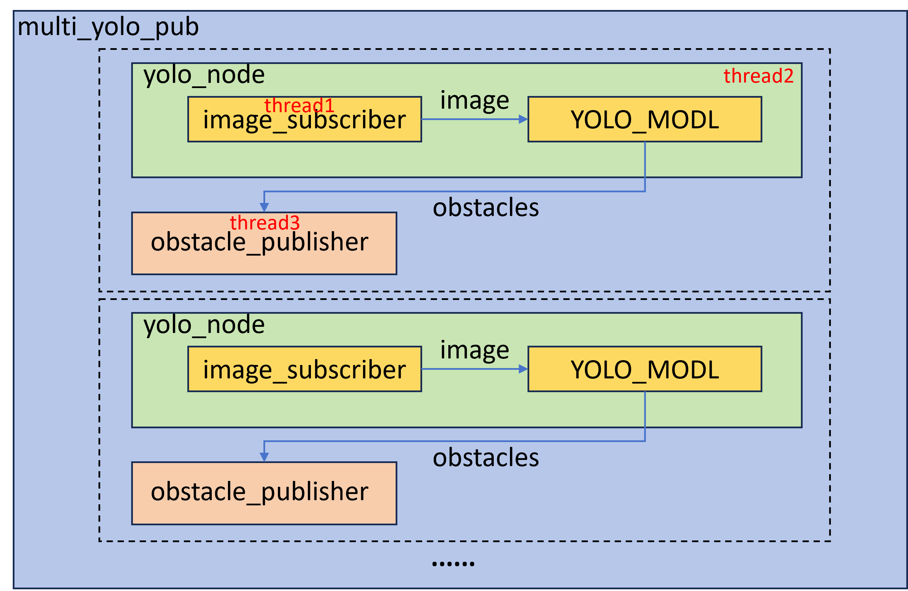

# rknn_yolo

## 项目说明
用于lpa3588的多AHD相机障碍物检测系统，该系统从图像节点订阅图像数据，使用yolov5检测障碍物信息，并通过iceoryx发布，供其它节点使用。

## 项目依赖
- RGA
- opencv
- iceoryx
- spdlog
- rknn
- libzip

## 总体结构图



## 编译
```bash
make clean # 可选
make # 默认是-j16
```
## 运行
确保采图节点已启动
```bash
sh run.sh
```

## 其余说明
- 检测新数据集类别时需要在`label.h`中扩展出新的数据集标签类，具体见`label.h 231:239`，并在创建`YOLO_MODEL`使用新的数据集标签类。

- 要启动`debug`日志等级，除了在`config/config.yaml`修改`log_level: "debug"`，还要修改`config/Makefile.config`中的编译选项`DEBUG=1`。